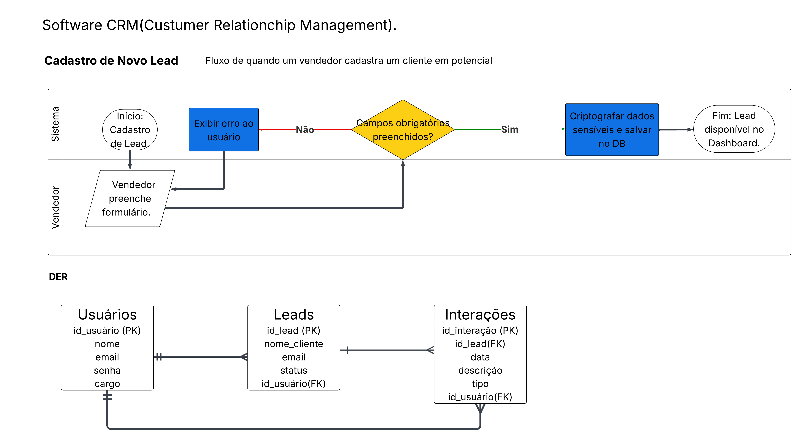

# Meu Primeiro CRM

Projeto focado no aprendizado de arquitetura de sistemas e gestão de leads.

## 📌 Planejamento
- [x] Fluxograma de Processos
- [x] Diagrama de Entidade e Relacionamento (DER)

## 🗄️ Modelo de Dados
O sistema utiliza um banco de dados relacional com as entidades: Usuários, Leads e Interações.



## 🚀 Funcionalidades

| # | Funcionalidade | Descrição |
|---|---|---|
| 1 | **Cadastrar Lead** | Registra um novo lead com validação e criptografia (Base64) |
| 2 | **Listar Leads** | Exibe todos os leads salvos em formato de tabela |
| 3 | **Buscar por Nome** | Filtra leads por nome (busca parcial, case-insensitive) |
| 4 | **Persistência JSON** | Dados salvos em `dados/leads.json` — sobrevivem ao fechar o terminal |

## 📂 Estrutura do Projeto

```
meu-primeiro-crm/
├── crm.js                  ← Ponto de entrada (menu interativo)
├── funcoes/
│   └── leads.js            ← Lógica de negócio (cadastrar, listar, buscar)
├── dados/
│   └── leads.json          ← Banco de dados local (JSON)
├── docs/
│   └── der-crm.png         ← Fluxograma e DER
├── teste-crm.js            ← Versão original (histórico)
└── README.md
```

## ▶️ Como Usar

1. Certifique-se de ter o [Node.js](https://nodejs.org/) instalado
2. No terminal, navegue até a pasta do projeto
3. Execute:

```bash
node crm.js
```

4. Use o menu interativo para cadastrar, listar e buscar leads!

## 📚 Conceitos Praticados

- **Módulos** (`require`, `module.exports`)
- **Leitura/Escrita de arquivos** (`fs.readFileSync`, `fs.writeFileSync`)
- **JSON** (`JSON.parse`, `JSON.stringify`)
- **Arrays** (`push`, `filter`, `map`, `Math.max`)
- **Strings** (`toLowerCase`, `includes`, `trim`)
- **Async/Await** e **Promises**
- **readline** (input do terminal)
- **switch/case** e **do-while**
