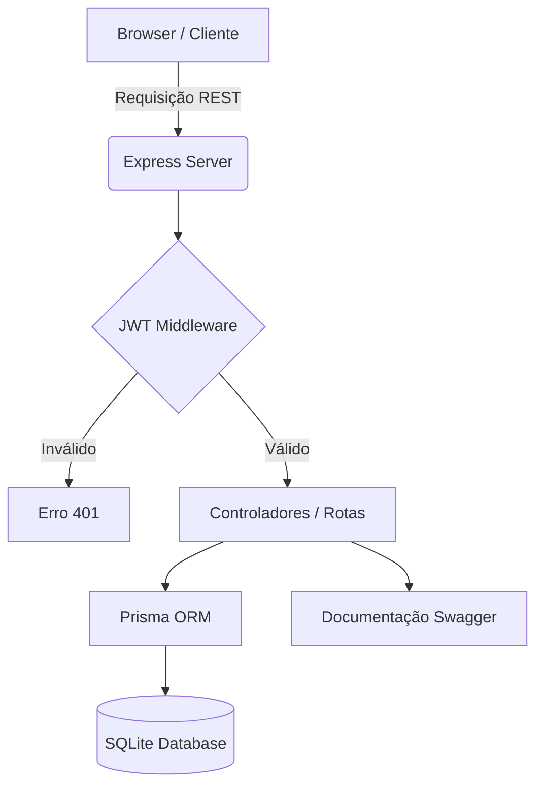

# 🚀 Meu Primeiro CRM - Pro Edition

Bem-vindo ao **Meu Primeiro CRM**, um projeto que evoluiu de um simples script CLI para uma aplicação web moderna com arquitetura robusta, seguindo os princípios de **Clean Code**, **TDD (Test-Driven Development)** e **DevOps**.

## 🏗️ Arquitetura do Sistema

O projeto agora funciona como uma **SPA (Single Page Application)** consumindo uma **API REST** segura.


```mermaid
graph TD
    A[Browser / Cliente] -->|Requisição REST| B(Express Server)
    B --> C{JWT Middleware}
    C -- Inválido --> D[Erro 401]
    C -- Válido --> E[Controladores / Rotas]
    E --> F[Prisma ORM]
    F --> G[(SQLite Database)]
    E --> H[Documentação Swagger]
```

### Tecnologias Utilizadas:
- **Backend:** Node.js + Express
- **Banco de Dados:** SQLite + Prisma ORM
- **Segurança:** JWT (JSON Web Tokens) e Criptografia AES-256 (via módulo `crypto`)
- **Frontend:** Vanilla JS (SPA) + CSS Moderno
- **DevOps:** Docker, Docker Compose e GitHub Actions (CI/CD)
- **Documentação:** Swagger (OpenAPI)

## 📖 Documentação da API (Swagger)

A API é totalmente documentada e pode ser testada interativamente.
1. Inicie o servidor.
2. Acesse: `http://localhost:3000/api-docs`

## ▶️ Como Rodar Localmente

### Pré-requisitos
- [Node.js](https://nodejs.org/) (v18 ou superior)
- Docker (opcional, para rodar via container)

### 1. Instalação
```bash
npm install
```

### 2. Configuração do Banco de Dados
Prepare o Prisma e gere o cliente:
```bash
npx prisma migrate dev
```

### 3. Execução
O projeto oferece dois modos de execução principals:

- **Modo Desenvolvimento (com auto-reload):**
  Ideal para quando você está editando o código. O servidor reinicia automaticamente a cada mudança.
  ```bash
  npm run dev
  ```

- **Modo Produção (estático):**
  Roda a aplicação de forma estável.
  ```bash
  npm start
  ```

> [!TIP]
> Também é possível rodar a versão antiga de linha de comando usando `npm run start:cli`.

### 4. Rodando com Docker
Se preferir não instalar o Node.js localmente, use o Docker:
```bash
docker-compose up -d
```

## 🧪 Testes Automatizados

Garantimos a qualidade do core do negócio através de testes com **Jest**.
```bash
npm test
```

## 📂 Estrutura de Pastas

```text
├── .github/workflows/  ← Automação CI/CD
├── dados/             ← Armazenamento SQLite
├── funcoes/           ← Lógica de Negócio (Camada de Serviço)
├── lib/               ← Utilitários e Instância do Prisma
├── middlewares/       ← Filtros de Segurança (JWT, Validação Zod)
├── public/            ← Frontend SPA (HTML/JS/CSS)
├── rotas/             ← Endpoints da API REST
├── schemas/           ← Esquemas de Validação (Zod)
├── tests/             ← Suítes de Testes Unitários
├── server.js          ← Ponto de Entrada do Servidor
└── Dockerfile         ← Configuração do Container
```
