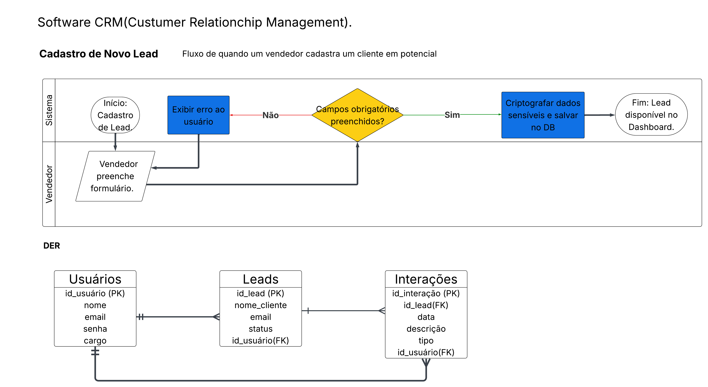

# Meu Primeiro CRM

Projeto focado no aprendizado de arquitetura de sistemas e gestão de leads, evoluído com conceitos de código robusto, segurança e Test-Driven Development (TDD).

## 📌 Planejamento
- [x] Fluxograma de Processos
- [x] Diagrama de Entidade e Relacionamento (DER)

## 🗄️ Modelo de Dados
O sistema utiliza um banco de dados relacional simulado com as entidades: Usuários, Leads e Interações.



## 🚀 Funcionalidades

| # | Funcionalidade | Descrição Técnica |
|---|---|---|
| 1 | **Cadastrar Lead** | Cria lead com validação de dados obrigatórios e encriptação de dados sensíveis (AES-256). |
| 2 | **Listar Leads** | Exibe painel com todos os leads cadastrados (tabela no console). |
| 3 | **Buscar por Nome** | Filtro case-insensitive de leads buscando parte do nome. |
| 4 | **Validação com Regex** | O e-mail informado nos cadastros e edições passa por rigorosa validação Regex contra erros de formato. |
| 5 | **Editar Lead por ID** | Permite alterar de forma parcial ou integral Nome, Telefone e E-mail de um lead existente. |
| 6 | **Funil de Vendas (Máquina de Estados)** | Evolui leads por status (Novo, Contatado, Qualificado, Proposta, Fechado, Perdido) usando validação rigorosa via **Enum**. |
| 7 | **Excluir Lead** | Remove leads por ID. |
| 8 | **Persistência JSON** | Dados armazenados localmente (`dados/leads.json`) permitindo continuidade entre sessões. |

## 📂 Estrutura do Projeto

```
meu-primeiro-crm/
├── crm.js                  ← Ponto de entrada (CLI Interativa)
├── funcoes/
│   ├── leads.js            ← Core da Lógica de Negócio e Enums
│   └── seguranca.js        ← Módulo de criptografia criptográfica (AES-256)
├── dados/
│   └── leads.json          ← Banco de dados local (JSON persistente)
├── tests/
│   └── leads.test.js       ← Suíte intensiva de testes unitários (Jest)
├── docs/                   ← Documentação (Fluxogramas, DERs)
└── README.md
```

## ▶️ Como Usar

1. Certifique-se de ter o [Node.js](https://nodejs.org/) instalado.
2. Clone o repositório e navegue até a pasta do projeto.
3. Instale as dependências de desenvolvedor:
   ```bash
   npm install
   ```
4. Execute a aplicação (CLI):
   ```bash
   node crm.js
   ```

## 🧪 Testes Automatizados (Jest)

A nossa camada de serviço principal (`funcoes/leads.js`) é coberta por rigorosos **Testes Unitários** utilizando `Jest`. Ao todo, as suítes checam casos de sucesso de manipulação do funil, validação correta via Regex e resiliência contra passagem de dados corrompidos.

Para rodar a bateria de testes, utilize o comando:
```bash
npm test
```

## 📚 Conceitos Praticados
Desde o primeiro commit, o projeto evoluiu focando em consolidar senioridade e boas práticas JavaScript:

- **Módulos ES6** (`import / export`)
- **Expressões Regulares** (Validação Regex)
- **Segurança de Dados** (Criptografia real usando a biblioteca `crypto` e AES-256 ao invés de codificação simples)
- **Máquinas de Estado / Enumeradores (Enum)** para gestão de Funil Imutável
- **TDD e Testes Unitários** (Configuração do `Jest` mockando bancos e limpando estado)
- **Manipulação de Arrays Moderno** (`findIndex`, `includes`, `filter`, `Math.max()`)
- **Tratamento Assíncrono** (`async/await` com Promises e manipulação assíncrona da `readline`)
- **Leitura/Escrita em File System** (`fs.readFileSync` e JS `JSON.parse`)
